# Evolución del mercado laboral y los ingresos en Gran Rosario y Gran Tucumán (2016-2025)

**Materia:** Introducción al Análisis de Datos - TUP, UTN
**Trabajo práctico final (2º parcial)** · Docente: Luis N. Fernández
**Integrantes:** _(completar: nombres de los integrantes)_
**Fuente:** Encuesta Permanente de Hogares (EPH), INDEC - base individual de aglomerados, todos los trimestres disponibles entre 2016 y 2025.

---

## 1. Introducción y datos

Se analiza la evolución de la tasa de actividad, la tasa de empleo, la tasa de desocupación y los ingresos de la población en dos aglomerados urbanos, **Gran Rosario** y **Gran Tucumán**, a partir de las bases de microdatos individuales de la EPH. Se procesaron **38 bases trimestrales** entre 2016 y 2025. El número de registros (personas) analizados es:

| Código | Aglomerado | Registros |
|---|---|---|
| 4 | Gran Rosario | 69.735 |
| 29 | Gran Tucumán | 83.478 |

Las tasas se construyen ponderando cada registro por el factor de expansión `PONDERA`. Las tablas de este informe presentan **promedios anuales** de los valores trimestrales; los gráficos muestran la serie trimestral completa.

---

## 2. Metodología

Indicadores del mercado laboral (definiciones del INDEC):

- PEA (población económicamente activa) = ocupados + desocupados.
- Tasa de actividad = PEA / población total.
- Tasa de empleo = ocupados / población total.
- Tasa de desocupación = desocupados / PEA.

La condición de actividad se toma de la variable `ESTADO`. Los ingresos nominales se deflactan con el **IPC Nivel General del INDEC** (promedio de cada trimestre) y se expresan en **pesos del 4º trimestre de 2025**:

> ingreso real = ingreso nominal x (IPC del período base / IPC del período)

El IPC de 2016 se empalma con el IPC-GBA (igual base, diciembre 2016 = 100), dado que la serie nacional comienza en diciembre de 2016. La no respuesta a los montos de ingreso se identifica con el código **-9** y se excluye del cálculo de promedios.

---

## 3. Objetivo 1 - Análisis univariado: no respuesta y valores atípicos

### 3.1 No respuesta a ingresos

La proporción de ocupados que no declara su ingreso de la ocupación principal (`P21` = -9) se presenta por trimestre:

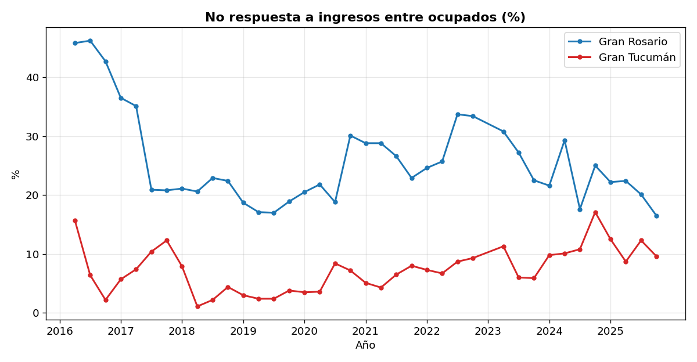

En Gran Rosario el porcentaje de no respuesta alcanza un máximo de 46,2% y en Gran Tucumán un máximo de 17,1% a lo largo del período analizado.

### 3.2 Valores atípicos (outliers)

Se aplicó el método del rango intercuartílico (IQR) sobre el ingreso real, considerando atípico todo valor por debajo de Q1 - 1,5 x IQR o por encima de Q3 + 1,5 x IQR:

| Aglomerado | Mediana | Q1 | Q3 | Límite sup. | Outliers | % | Máx. |
|---|---|---|---|---|---|---|---|
| Gran Rosario | $724.818 | $439.618 | $1.191.695 | $2.319.811 | 1606 | 4,8% | 40,1 M |
| Gran Tucumán | $560.909 | $339.123 | $961.834 | $1.895.902 | 2465 | 5,2% | 43,8 M |

La distribución del ingreso y sus valores atípicos se observan en el siguiente diagrama de cajas (escala logarítmica, que permite visualizar el rango completo):

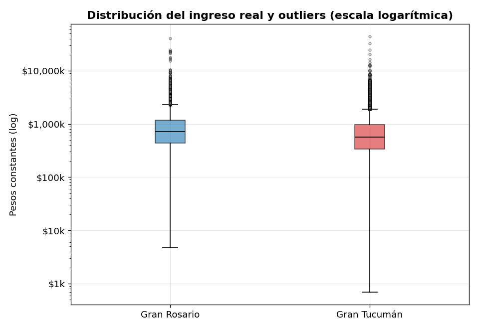

El diagrama de cajas por año muestra cómo se desplaza la distribución a lo largo del tiempo:

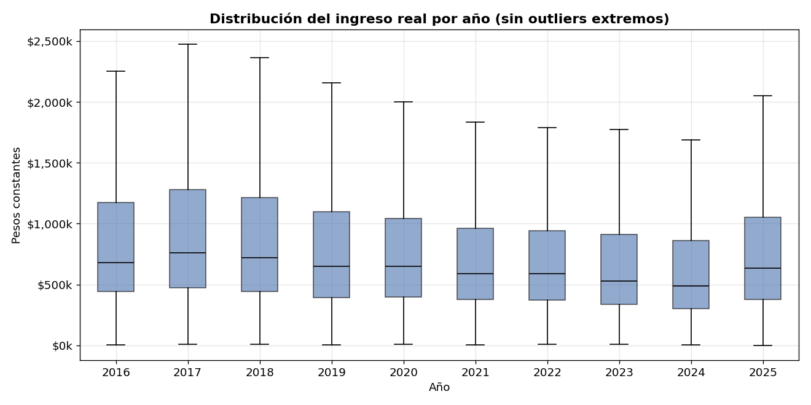

---

## 4. Objetivo 2 - Evolución de los indicadores

### 4.1 Tasas del mercado laboral

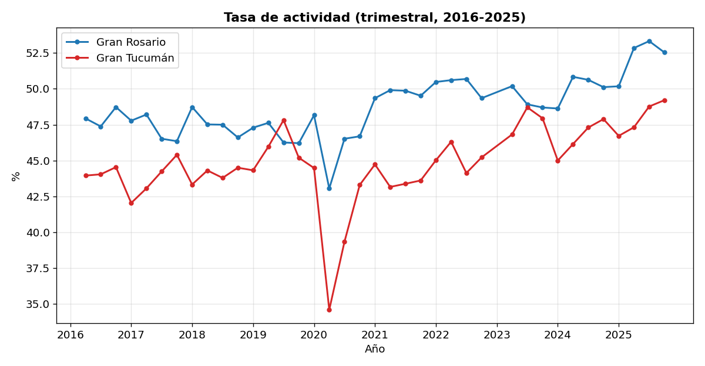

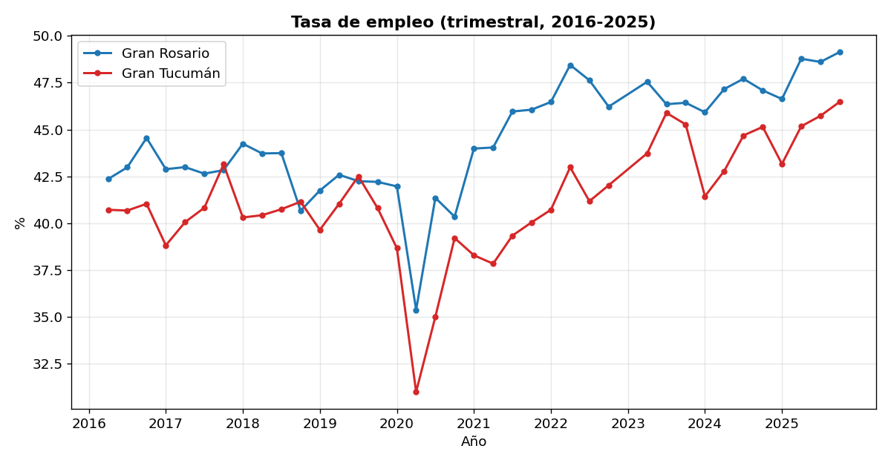

Tasa de empleo (promedio anual, %):

| Año | Gran Rosario | Gran Tucumán |
|---|---|---|
| 2016 | 43,3% | 40,8% |
| 2017 | 42,8% | 40,7% |
| 2018 | 43,1% | 40,6% |
| 2019 | 42,2% | 41,0% |
| 2020 | 39,8% | 36,0% |
| 2021 | 45,0% | 38,9% |
| 2022 | 47,2% | 41,7% |
| 2023 | 46,8% | 45,0% |
| 2024 | 47,0% | 43,5% |
| 2025 | 48,3% | 45,1% |

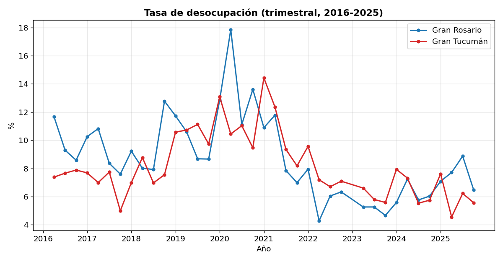

Tasa de desocupación (promedio anual, %):

| Año | Gran Rosario | Gran Tucumán |
|---|---|---|
| 2016 | 9,8% | 7,6% |
| 2017 | 9,2% | 6,8% |
| 2018 | 9,5% | 7,6% |
| 2019 | 9,9% | 10,5% |
| 2020 | 13,9% | 11,0% |
| 2021 | 9,4% | 11,1% |
| 2022 | 6,1% | 7,6% |
| 2023 | 5,1% | 6,0% |
| 2024 | 6,2% | 6,6% |
| 2025 | 7,5% | 6,0% |

### 4.2 Ingresos reales

La comparación entre el ingreso nominal y el ingreso real (deflactado) se presenta a continuación:

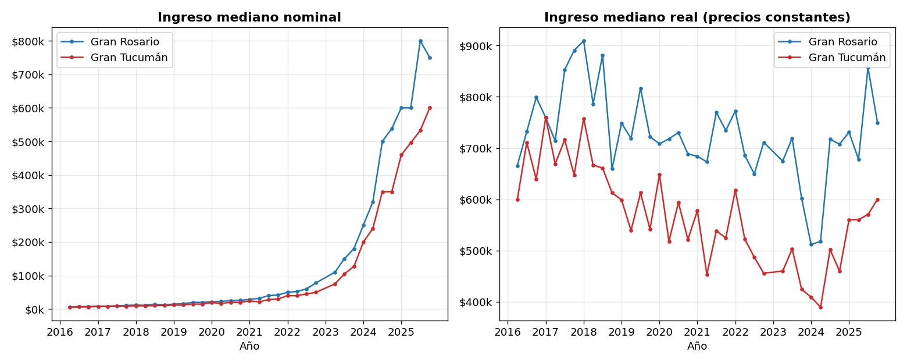

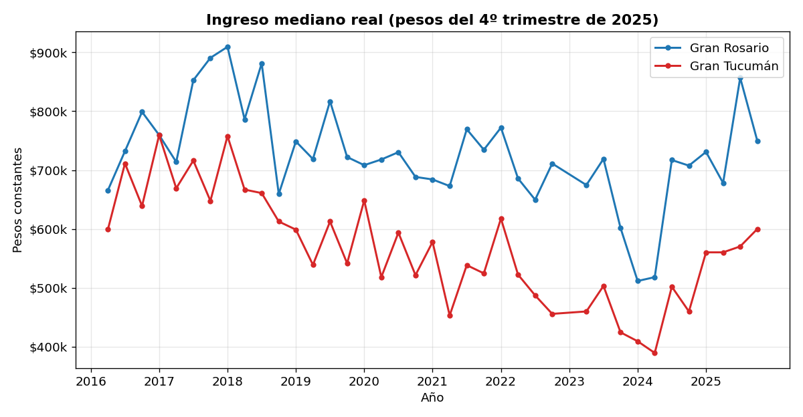

Ingreso mediano real (promedio anual, pesos del 4º trimestre de 2025):

| Año | Gran Rosario | Gran Tucumán |
|---|---|---|
| 2016 | $732.281 | $649.856 |
| 2017 | $804.198 | $698.206 |
| 2018 | $809.122 | $674.631 |
| 2019 | $751.713 | $573.144 |
| 2020 | $711.370 | $570.629 |
| 2021 | $715.292 | $523.632 |
| 2022 | $704.762 | $520.888 |
| 2023 | $665.157 | $462.635 |
| 2024 | $613.703 | $440.212 |
| 2025 | $754.034 | $572.798 |

Entre 2016 y 2025, el ingreso real mediano (promedio anual) varía **+3,0%** en Gran Rosario y **-11,9%** en Gran Tucumán.

### 4.3 Análisis multivariado

Ingreso real mediano según nivel educativo (2025):

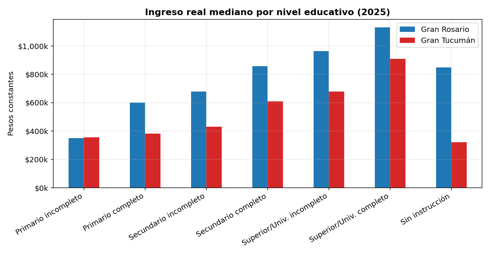

Ingreso real mediano según calificación de la tarea (2025, último dígito de `PP04D_COD`):

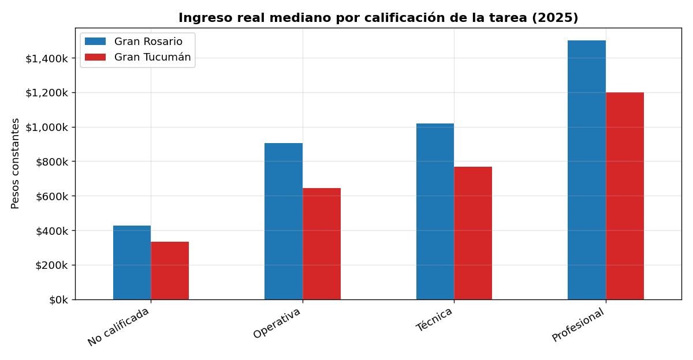

| Calificación | Gran Rosario | Gran Tucumán |
|---|---|---|
| Profesional | $1.500.000 | $1.200.000 |
| Técnica | $1.017.368 | $767.475 |
| Operativa | $904.327 | $642.722 |
| No calificada | $426.375 | $334.020 |

Brecha de género (cociente entre el ingreso mediano de mujeres y varones), por trimestre:

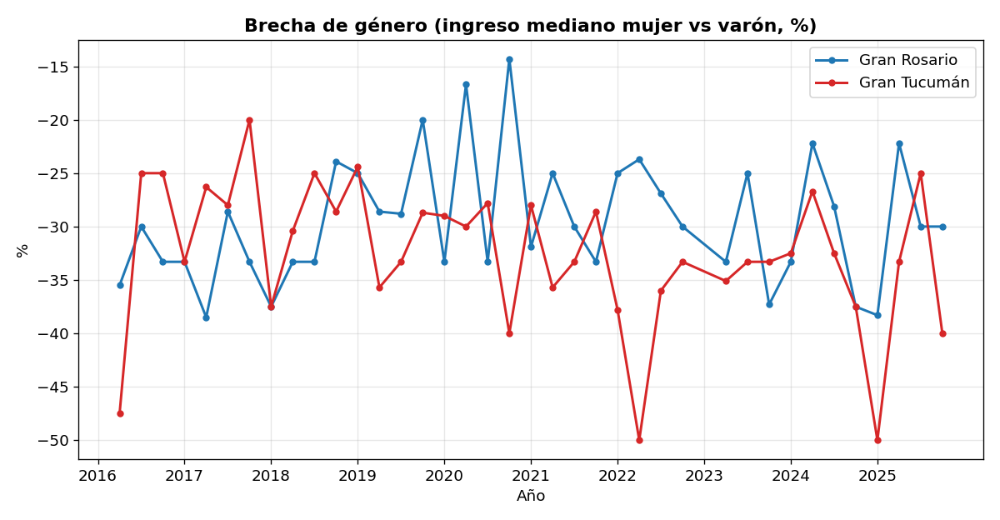

---

## 5. Objetivo 3 - Visualización

Los gráficos se generaron con `matplotlib` a partir de las tablas calculadas. Se utilizó un color fijo por aglomerado en las series de tiempo y diagramas de cajas para la distribución del ingreso.

---

## 6. Objetivo 4 - Modelo de imputación de la no respuesta a ingresos

Se ajustó un modelo de **regresión lineal** para estimar el ingreso de los ocupados que no declararon `P21`. La variable dependiente es el logaritmo natural del ingreso. Las variables independientes son: edad y edad², sexo, nivel educativo, calificación de la tarea, aglomerado y período (efecto fijo de año-trimestre, que absorbe la variación de precios). El modelo se entrenó sobre el 80% de los ocupados que declararon ingreso y se evaluó sobre el 20% restante.

| Métrica | Valor |
|---|---|
| R² (test) | 0,822 |
| RMSE (escala log) | 0,721 |
| Casos de entrenamiento | 52.503 |
| Casos imputados | 10.507 |

El coeficiente de determinación R² indica la proporción de la variabilidad del logaritmo del ingreso explicada por el modelo. La influencia de cada variable independiente (en un modelo logarítmico, cada coeficiente equivale aproximadamente a un cambio porcentual del ingreso respecto de la categoría base) se presenta a continuación:

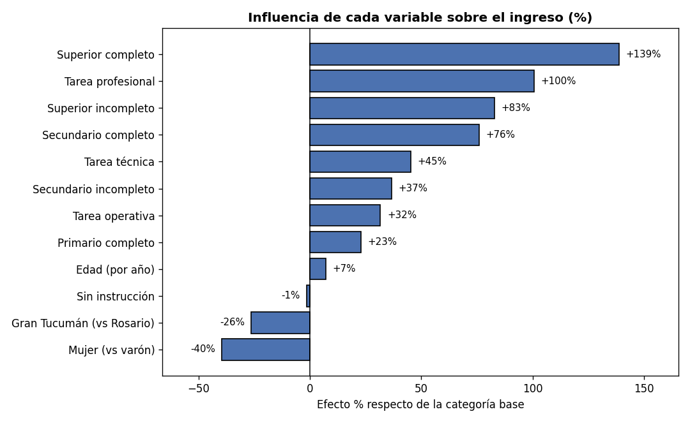

Según el modelo:

- Nivel educativo superior completo: **+139%** respecto de primario incompleto.
- Tarea profesional: **+100%** respecto de tarea no calificada.
- Sexo femenino: **-39,5%** respecto del masculino, a igualdad del resto de las variables.
- Aglomerado Gran Tucumán: **-26,3%** respecto de Gran Rosario.
- Edad: **+7,1%** por año, con término cuadrático negativo (relación cóncava).

Aplicado a los 10,507 ocupados sin respuesta, el modelo estima una mediana de ingreso real de **$739.276**.

---

*Análisis realizado con Python (pandas, scikit-learn, matplotlib) sobre las bases de microdatos de la EPH del INDEC.*
