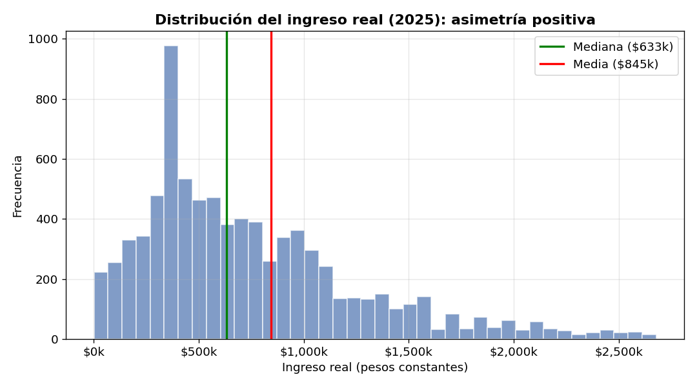
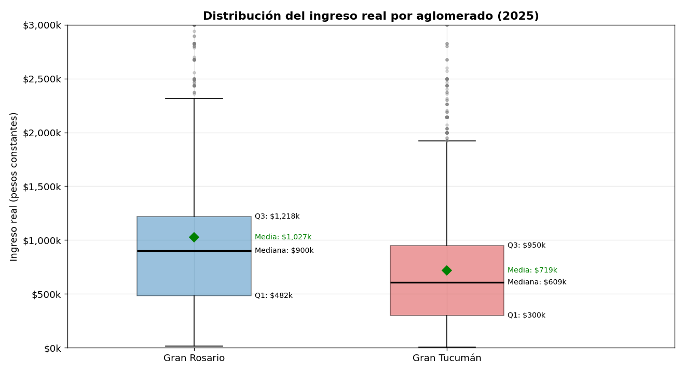
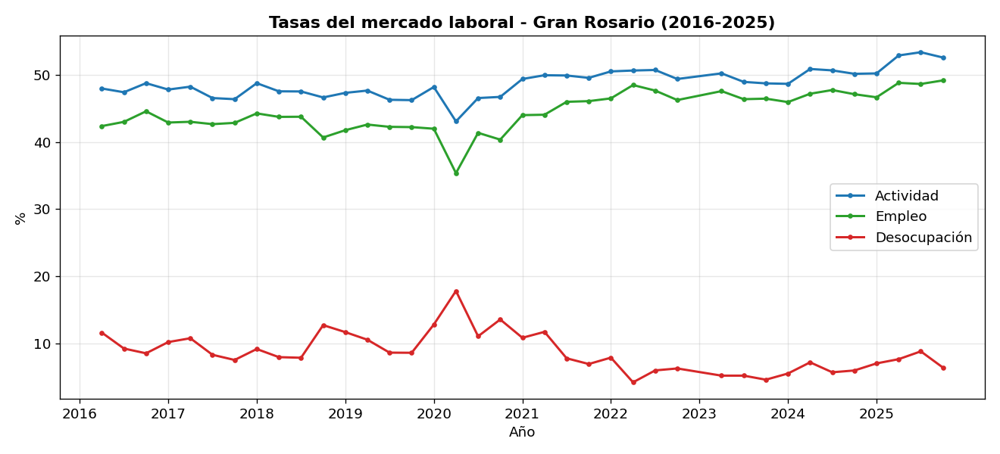
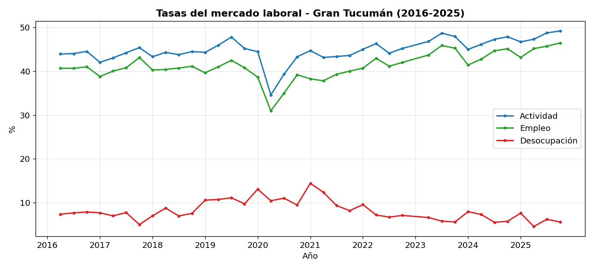
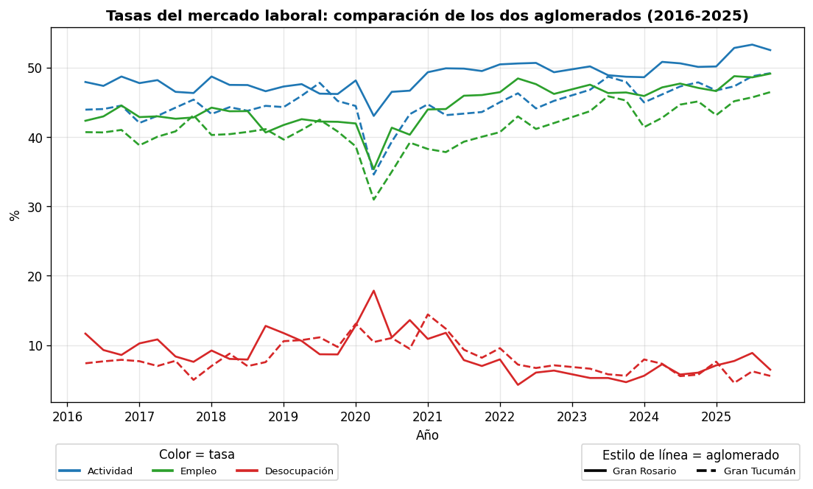
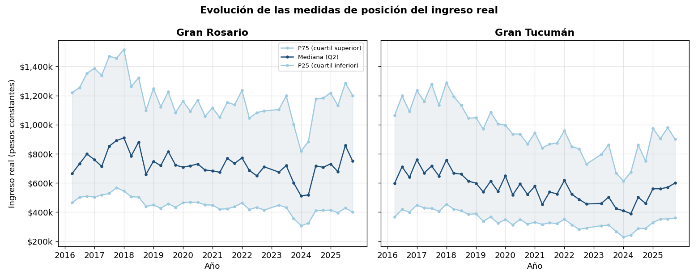
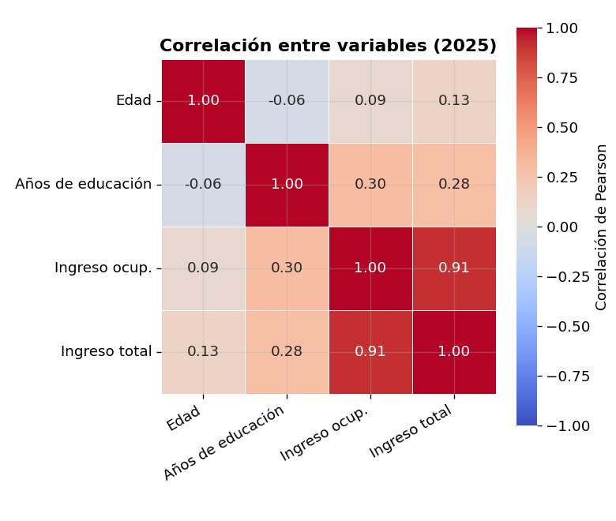
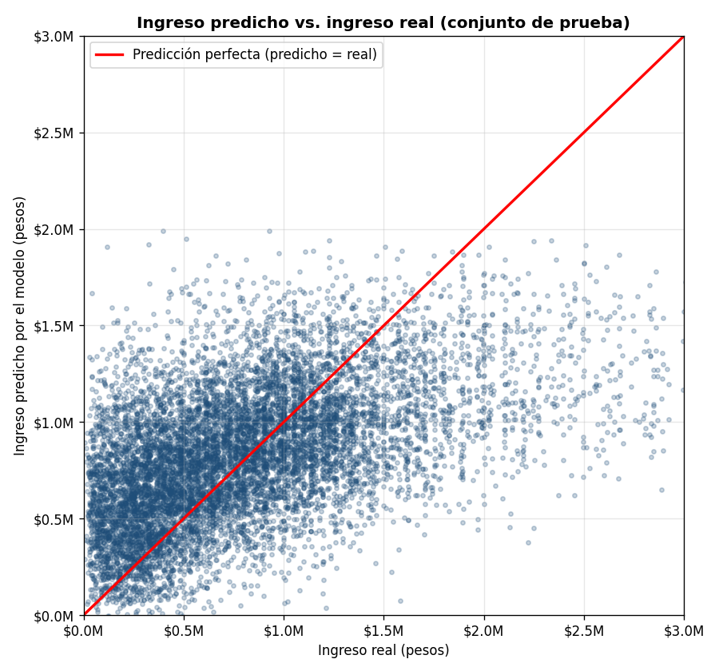
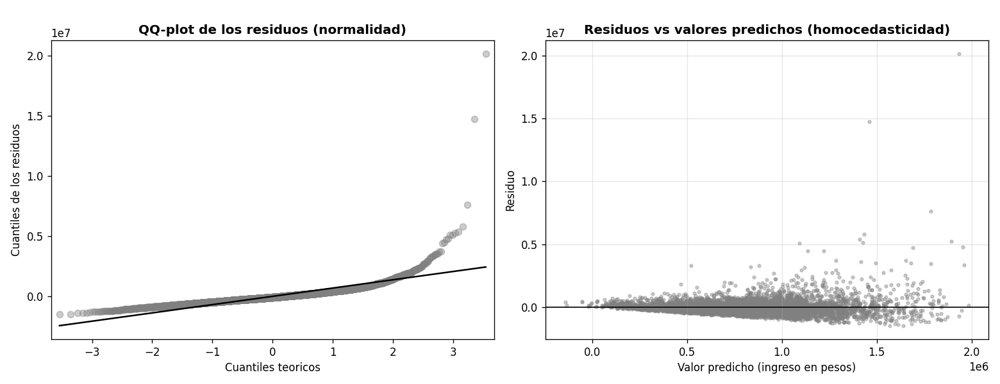

|   |   |
|--|--|
| **Materia** | Introducción al Análisis de Datos - TUP, UTN |
| **Docente** | Luis N. Fernández |
| **Integrantes** | Tomás Salvador Canela, Laura Carelli, Lautaro Dellagiovanna, Sebastián Hernández García. |
| **Fuente** | Encuesta Permanente de Hogares (EPH), INDEC. Base individual de aglomerados, todos los trimestres disponibles entre 2016 y 2025. |

## Trabajo práctico final (recuperatorio 2do parcial)
# Evolución del mercado laboral y los ingresos en Gran Rosario y Gran Tucumán (2016-2025)

---

## Introducción

Para este trabajo tomamos las bases de la Encuesta Permanente de Hogares (EPH) del INDEC y analizamos cómo evolucionaron, entre 2016 y 2025, la tasa de actividad, la de empleo, la de desocupación y los ingresos en dos aglomerados: **Gran Rosario** y **Gran Tucumán**. Trabajamos con las bases individuales de los 38 trimestres disponibles, quedándonos solo con los registros de esos dos aglomerados.

En estos años hubo mucha inflación, así que a los ingresos siempre los miramos en términos **reales**, es decir, descontando la suba de precios, para poder comparar de forma justa un peso de 2016 con uno de 2025. Para eso ajustamos cada monto con el índice de precios (IPC) del INDEC y los dejamos todos expresados en pesos del 4º trimestre de 2025. Para las tasas de actividad, empleo y desocupación usamos una variable de la EPH llamada `ESTADO`, que indica si cada persona está ocupada, desocupada o inactiva, y a cada persona la pesamos por su `PONDERA`, que es un número que dice a cuántas personas de la población representa (la EPH es una encuesta a una muestra, así que cada respuesta vale por muchas personas más).

Cada variable la usamos según su tipo. Las **cuantitativas** (el ingreso y la edad) las trabajamos directamente como números. Las **ordinales** (el nivel educativo y la calificación de la tarea) tienen un orden pero no una distancia entre categorías, así que cuando las necesitamos como números les asignamos una escala con sentido: al nivel educativo le ponemos los años de educación que corresponden a cada nivel, y a la calificación un puntaje de 1 a 4. Las **nominales** de dos categorías (el sexo y el aglomerado) las pasamos a 0 y 1; y las nominales de varias categorías sin orden (la condición de actividad y la rama de actividad) no las convertimos en números, sino que medimos su relación con el ingreso con el **eta cuadrado** (que indica qué parte de la variación del ingreso explican los grupos) o la V de Cramer.

---

## 1. Análisis univariado

La variable que exploramos es el **ingreso real de la ocupación principal** de los ocupados, es decir, lo que gana cada persona en su trabajo principal, **ajustado por la inflación**. Vemos cómo se distribuye, qué valores atípicos tiene y cuánta gente no declara cuánto gana.

### 1.1 Exploración y medidas de resumen

Calculamos las medidas de resumen del ingreso real en el último año (2025). La tabla muestra primero los **insumos** del cálculo (cuántas personas hay, cuántos varones y mujeres, y la suma de todos los ingresos) y después las medidas que salen de ahí; por ejemplo, la media es esa suma dividida la cantidad de personas:

| Medida | Gran Rosario | Gran Tucumán |
|---|---|---|
| Cantidad de personas | 2.477 | 3.336 |
| Varones | 1.304 | 1.797 |
| Mujeres | 1.173 | 1.539 |
| Suma de los ingresos (total) | $2.543.021.122 | $2.397.567.431 |
| Suma de ingresos de varones | $1.590.284.974 | $1.521.691.199 |
| Suma de ingresos de mujeres | $952.736.148 | $875.876.232 |
| Media general (suma ÷ personas) | $1.026.654 | $718.695 |
| Promedio de varones | $1.219.544 | $846.795 |
| Promedio de mujeres | $812.222 | $569.120 |
| Mediana | $900.000 | $609.107 |
| Desvío estándar | $1.036.480 | $665.071 |
| Coef. de variación | 101,0% | 92,5% |
| Asimetría (Fisher) | 8,54 | 5,55 |
| Curtosis | 142,7 | 82,5 |
| Mínimo | $15.000 | $5.652 |
| Q1 | $482.041 | $300.000 |
| Q3 | $1.218.214 | $950.000 |
| Máximo | 22,0 M | 15,0 M |

Lo primero que se nota es que la **media es bastante mayor que la mediana**. Esto pasa porque la distribución del ingreso es **muy asimétrica, con una cola hacia la derecha**: la mayoría gana poco o un valor medio, y una minoría gana mucho, y esos pocos ingresos altos tiran del promedio hacia arriba. El **coeficiente de asimetría de Fisher**, que es positivo, confirma esa cola a la derecha, y la **curtosis** (que mide qué tan pesadas son las colas, o sea cuántos valores extremos hay: en una distribución normal vale 3) está acá muy por encima de 3, lo que confirma que hay muchos más ingresos extremos de lo habitual. El **coeficiente de variación**, cercano al 100%, muestra que los ingresos son muy desiguales. Para leer la forma de la distribución no nos fijamos en un solo dato, sino en cómo se relacionan: la **media frente a la mediana** y la **asimetría** nos dicen hacia qué lado se inclina; la **curtosis**, cuántos valores extremos hay; y el **coeficiente de variación**, qué tan dispares son los ingresos. Por todo esto, para resumir el ingreso preferimos la **mediana**, que no se deja arrastrar por los valores extremos como sí le pasa a la media. El histograma deja ver esa forma:

### 1.2 Valores atípicos

Para detectar los valores atípicos del ingreso usamos dos métodos:  El primero es el del **rango intercuartílico**: marcamos como atípico moderado a todo valor que esté a más de 1,5 rangos del cuartil 3, y como severo al que esté a más de 3 rangos. El segundo es el **z-score** (la regla de los tres desvíos), que marca como atípico a todo ingreso que esté a más de 3 desvíos de la media.

En el boxplot, la **caja** va del primer cuartil (Q1) al tercero (Q3) y contiene al 50% del medio de los ingresos; la **línea negra** es la mediana y el **diamante verde**, la media (que queda más arriba, arrastrada por los ingresos altos); los **bigotes** llegan hasta 1,5 veces el rango entre cuartiles y los **puntos grises** son los outliers, que siguen incluso por encima del tope del gráfico. En números, los dos métodos quedan así:

| Aglomerado | Q1 | Q3 | RI | Out. moderados | Out. severos | % (IQR) | Out. z-score |
|---|---|---|---|---|---|---|---|
| Gran Rosario | $482.041 | $1.218.214 | $736.173 | 104 | 39 | 5,8% | 24 |
| Gran Tucumán | $300.000 | $950.000 | $650.000 | 95 | 40 | 4,0% | 45 |

Los dos métodos coinciden en que los atípicos son alrededor del 5% de los casos y están casi todos en la **parte alta** (ingresos muy altos). Acá fue importante distinguir un **outlier** de una **inconsistencia**: un ingreso muy alto es un valor **posible** (hay gente que gana mucho), no un error, así que decidimos **no eliminarlos**; en cambio, un valor imposible (como un ingreso negativo) sí habría que sacarlo. Justamente porque existen estos valores altos es que preferimos la mediana y el rango intercuartílico, que son medidas robustas.

### 1.3 No respuesta a ingresos

Otra cosa que miramos a nivel univariado es la **no respuesta**: ocupados que trabajan pero no dicen cuánto ganan (en la EPH se marca con el código -9). Nos importa porque quienes no contestan pueden tener un perfil distinto del resto (por ejemplo, los que más ganan), y si los ignoramos podemos sesgar las estimaciones. En nuestros datos la no respuesta llega a un máximo de 46,2% en Gran Rosario y 17,1% en Gran Tucumán.

Por eso decidimos no descartar esos casos ni completarlos con la media (que deformaría la distribución), sino estimarlos con un modelo, que es lo que hacemos en la parte **3. Modelo de imputación de la no respuesta a ingresos**.

---

## 2. Análisis multivariado

En esta parte cruzamos las variables: primero vemos cómo evolucionaron los indicadores a lo largo del tiempo, y después cómo cambia el ingreso según el nivel educativo, las características del empleo, el sexo y la edad.

### 2.1 Evolución de las tasas del mercado laboral

Primero miramos cada aglomerado por separado, con sus tres tasas juntas, y después los comparamos en un mismo gráfico.

En **Gran Rosario**, la actividad y el empleo se mueven casi en paralelo y bastante por encima de la desocupación. En 2020 las tres se quiebran de golpe (caen la actividad y el empleo, y salta la desocupación, que llega a 13,9% en 2020); después la desocupación baja con fuerza y la actividad y el empleo se recuperan hacia el final del período.

En **Gran Tucumán** el patrón es parecido, pero la desocupación tiene su punto más alto un poco más tarde, en 2021 (11,1%), y la actividad y el empleo se mueven en valores similares, en general apenas por debajo de los de Gran Rosario.

Para compararlos directamente pusimos las tres tasas de los dos aglomerados en un mismo gráfico. El **color** indica la tasa (actividad, empleo y desocupación) y el **estilo de línea**, el aglomerado (línea llena para Gran Rosario y punteada para Gran Tucumán); las referencias están abajo del gráfico.

Así se ve todo de una: las dos ciudades tienen una actividad y un empleo bastante parecidos, y la diferencia más marcada está en la desocupación, sobre todo en el momento del pico (2020 en Gran Rosario, 2021 en Gran Tucumán). La tasa de desocupación, año a año, fue:

| Año | Gran Rosario | Gran Tucumán |
|---|---|---|
| 2016 | 9,8% | 7,6% |
| 2017 | 9,2% | 6,8% |
| 2018 | 9,5% | 7,6% |
| 2019 | 9,9% | 10,5% |
| 2020 | 13,9% | 11,0% |
| 2021 | 9,4% | 11,1% |
| 2022 | 6,1% | 7,6% |
| 2023 | 5,1% | 6,0% |
| 2024 | 6,2% | 6,6% |
| 2025 | 7,5% | 6,0% |

### 2.2 Evolución del ingreso real: tendencia central y posición

Para los ingresos, comparar el **nominal** con el **real** es la mejor forma de ver el efecto de la inflación: el nominal sube siempre porque suben los precios, pero el real muestra qué pasó de verdad con el poder de compra.

Entre 2016 y 2025, el ingreso real mediano (promedio anual) varió **+3,0%** en Gran Rosario y **-11,9%** en Gran Tucumán. Más allá del número, lo que se ve es una **pérdida de poder de compra** en los años de más inflación y una recuperación parcial hacia el final.

| Año | Gran Rosario | Gran Tucumán |
|---|---|---|
| 2016 | $732.281 | $649.856 |
| 2017 | $804.198 | $698.206 |
| 2018 | $809.122 | $674.631 |
| 2019 | $751.713 | $573.144 |
| 2020 | $711.370 | $570.629 |
| 2021 | $715.292 | $523.632 |
| 2022 | $704.762 | $520.888 |
| 2023 | $665.157 | $462.635 |
| 2024 | $613.703 | $440.212 |
| 2025 | $754.034 | $572.798 |

Además de la mediana, seguimos las **medidas de posición** (los cuartiles). La banda entre el primer cuartil (P25) y el tercero (P75) contiene al 50% del medio de los ingresos, y su ancho muestra qué tan dispares son:

### 2.3 El ingreso según el nivel educativo

Cuando cruzamos el ingreso con el **nivel educativo** vemos una relación clara: a mayor nivel, mayor ingreso mediano (y también más dispersión dentro de cada grupo):

El boxplot compara los dos aglomerados en cada nivel educativo. La tabla siguiente resume los números por nivel (juntando los dos aglomerados): la cantidad de personas (N), el primer cuartil (Q1), la mediana, el tercer cuartil (Q3) y la media.

| Nivel educativo | N | Q1 | Mediana | Q3 | Media |
|---|---|---|---|---|---|
| Sin instrucción | 10 | $262.732 | $593.906 | $1.186.952 | $842.855 |
| Primario incompleto | 169 | $160.680 | $350.000 | $609.107 | $429.919 |
| Primario completo | 693 | $243.643 | $452.164 | $791.286 | $556.628 |
| Secundario incompleto | 1.017 | $271.298 | $500.000 | $832.040 | $606.089 |
| Secundario completo | 1.659 | $376.284 | $730.929 | $1.017.368 | $788.796 |
| Superior/Univ. incompleto | 1.002 | $426.375 | $749.842 | $1.096.393 | $872.788 |
| Superior/Univ. completo | 1.263 | $730.929 | $1.017.368 | $1.606.804 | $1.325.591 |

Para ponerle un número a esa asociación usamos el coeficiente **eta cuadrado**, que mide qué parte de la variación del ingreso explica cada variable: el nivel educativo explica el 10,4% de la variabilidad del ingreso.

### 2.4 El ingreso según las características del empleo

La consigna nos pedía mirar también las características del empleo (`PP04B_COD`, la rama de actividad, y `PP04D_COD`, la calificación de la tarea). La **calificación** es la que más pesa: explica el 12,9% de la variabilidad del ingreso, todavía un poco más que el nivel educativo. El ingreso mediano por calificación es:

| Calificación | Gran Rosario | Gran Tucumán |
|---|---|---|
| Profesional | $1.500.000 | $1.200.000 |
| Técnica | $1.017.368 | $767.475 |
| Operativa | $904.327 | $642.722 |
| No calificada | $426.375 | $334.020 |

La **rama de actividad** también muestra diferencias, aunque más chicas (eta cuadrado de 0,09).

### 2.5 El ingreso según el sexo y la edad

Comparando varones y mujeres aparece una **brecha de género** que se mantiene en todo el período: las mujeres ganan en promedio 29,6% menos en Gran Rosario y 32,6% menos en Gran Tucumán. En el último año la diferencia fue:

| Aglomerado | Varones | Mujeres | Diferencia | Brecha |
|---|---|---|---|---|
| Gran Rosario | $1.000.000 | $730.929 | $269.071 | -26,9% |
| Gran Tucumán | $730.929 | $452.164 | $278.765 | -38,1% |

El **mapa de calor** se lee así: cada celda es la **correlación de Pearson** entre dos variables, que va de **-1 a 1** (cerca de 1, las dos suben juntas; cerca de 0, no hay relación lineal). El color lo acompaña: cuanto más rojo, más cerca de 1. Ordenando de la más fuerte a la más débil:

- La relación **más fuerte** es entre el **ingreso de la ocupación principal y el ingreso total** (0,908, casi 1). Es esperable, porque el ingreso total **incluye** al de la ocupación principal: quien gana más en su trabajo, gana más en total.
- Después viene **años de educación con el ingreso** (0,3): una relación positiva y moderada (a más educación, más ingreso).
- La más **débil** es la de la **edad con el ingreso** (0,085), justamente porque esa relación no es una recta.

### 2.6 Qué medida usamos en cada cruce

Un detalle que cuidamos fue usar en cada cruce la medida que corresponde al tipo de las variables:

| Cruce | Tipos | Medida | Valor |
|--|--|--|--|
| Edad con ingreso | cuantitativa con cuantitativa | Pearson y Spearman | 0,085 y 0,103 |
| Nivel educativo con ingreso | ordinal (pasada a años de educación) | eta², Spearman y Pearson | 10,4%, 0,372 y 0,3 |
| Calificación con ingreso | ordinal con cuantitativa | eta² | 12,9% |
| Sexo con ingreso | nominal con cuantitativa | eta² | 3,7% |
| Nivel educativo con condición de actividad | nominal con nominal | V de Cramer | 0,129 |

La idea es simple: **Pearson** solo entre variables cuantitativas; para una categórica con una cuantitativa, **eta cuadrado**; y entre dos categóricas, la **V de Cramer**. Cuando una variable es ordinal, como el nivel educativo, además del eta cuadrado la podemos pasar a una escala numérica con sentido (años de educación) y ahí sí calcular Pearson; lo que no corresponde es usar Pearson sobre los códigos crudos.

---

## 3. Modelo de imputación de la no respuesta a ingresos

Para completar la no respuesta a los ingresos armamos un modelo de **regresión lineal múltiple**. Los coeficientes se calculan por el método de **mínimos cuadrados** (OLS, *Ordinary Least Squares*): elige los valores que hacen más chica la **suma de los errores al cuadrado**, es decir, la combinación que mejor se ajusta al conjunto de los datos. La idea es aprender la relación entre el ingreso y las características de cada persona usando a quienes sí declararon su ingreso, y después usar esa relación para estimar el de quienes no respondieron.

La variable que queremos predecir es el **ingreso real, en pesos**. Lo dejamos en pesos (su escala original) para que cada coeficiente se interprete directamente en pesos. Las variables explicativas son todas numéricas: la **edad**, los **años de educación** (el nivel educativo pasado a una escala numérica) y la **calificación de la tarea** (un puntaje de 1 a 4), más dos indicadores 0/1 para el **sexo** y el **aglomerado**. Para evaluar el modelo separamos los datos en dos partes: entrenamos con el 80% y probamos con el 20% que el modelo no vio, así medimos si de verdad sirve para casos nuevos y no solo memoriza los datos.

| Métrica | Valor |
|---|---|
| R² | 0,248 |
| R² ajustado | 0,248 |
| R² en validación (test) | 0,228 |
| RMSE (test, en pesos) | $620.591 |
| MAE (test, en pesos) | $391.214 |
| Casos de entrenamiento | 52.295 |
| Casos imputados | 10.422 |

El **R²** nos dice qué parte de la variabilidad del ingreso explica el modelo. Nos dio 0,248 en entrenamiento y 0,228 en la prueba: son parecidos, y el de prueba un poco más bajo, que es lo esperable, porque el modelo siempre ajusta un poco mejor sobre los datos con los que se entrenó. Que sean tan parecidos nos dice que el modelo **generaliza bien** y no está sobreajustado. El **RMSE** y el **MAE** miden cuánto se equivoca el modelo, en pesos. El **MAE** (error medio absoluto) es el promedio de lo que le erra a cada persona, sin importar si predice de más o de menos: dio $391.214, así que en promedio el modelo se aparta del ingreso real en esa cifra. El **RMSE** (raíz del error cuadrático medio) es parecido, pero antes de promediar eleva cada error al cuadrado, así que les da más peso a los errores grandes; por eso queda más alto ($620.591) y nos avisa de que hay algunas predicciones que se van bastante lejos.

Otra forma de ver qué tan bien predice es comparar, para cada persona del conjunto de prueba, el ingreso que el modelo estimó contra el que realmente tenía. Si el modelo fuera perfecto, todos los puntos caerían sobre la diagonal roja:

La nube de puntos sigue la diagonal pero con bastante dispersión: el modelo acierta la tendencia general, aunque le cuesta con los ingresos más altos (los predice más bajos de lo que son). Eso es coherente con que el RMSE sea bastante mayor que el MAE.

Como el modelo está en pesos, cada coeficiente nos dice cuántos pesos cambia el ingreso por cada unidad de la variable, dejando el resto fijo:

- Cada **año de educación** suma +$44.633 al ingreso.
- Cada **nivel de calificación** de la tarea suma +$203.860.
- Cada **año de edad** suma +$6.851.
- Ser **mujer** implica -$317.773 respecto de un varón.
- Vivir en **Gran Tucumán** implica -$221.188 respecto de **Gran Rosario**.

Estos resultados van en la misma línea que el análisis multivariado: la educación y la calificación son lo que más sube el ingreso, y siguen apareciendo la brecha de género y la diferencia entre aglomerados.

### 3.1 Diagnóstico del modelo

Para revisar que el modelo sea válido miramos los residuos (los errores). El **QQ-plot** compara los residuos con una distribución normal (si caen sobre la diagonal, son aproximadamente normales) y el gráfico de **residuos contra valores predichos** sirve para ver que el error no tenga un patrón y se mantenga parejo. Como hay algunos ingresos muy altos, es esperable que en los extremos los residuos se aparten un poco de la normal.

### 3.2 Imputación

Con el modelo ya entrenado estimamos el ingreso de los 10.422 ocupados que no habían respondido, y nos dio una mediana imputada de **$975.569**. Completar la no respuesta de esta forma, según las características de cada persona, es mejor que imputar con la media, que metería a todos en un mismo valor y deformaría la distribución.

---

## Conclusiones

Analizando la EPH entre 2016 y 2025 para Gran Rosario y Gran Tucumán pudimos seguir cómo se movieron el mercado laboral y los ingresos en un período difícil, con mucha inflación y la pandemia de 2020 de por medio. Las tasas de actividad, empleo y desocupación muestran ese impacto, con el quiebre de 2020 bien marcado.

En los ingresos, mirarlos en términos reales nos dejó ver la pérdida de poder de compra, que fue distinta entre los dos aglomerados. Vimos que el ingreso es muy desigual y asimétrico, por eso lo resumimos con la mediana y los cuartiles.

En el análisis multivariado, lo que más se asocia a mayores ingresos es el nivel educativo y la calificación de la tarea, y también quedó clara una brecha de género que se sostiene en el tiempo. Para cada cruce usamos la medida que correspondía al tipo de variable.

Por último, el modelo de regresión nos permitió imputar la no respuesta a partir de las características de cada persona, con un rendimiento razonable sobre datos nuevos y coeficientes fáciles de interpretar, en pesos.

---

## Bibliografía

- INDEC. *Encuesta Permanente de Hogares (EPH)*. Bases de microdatos y diseño de registro. Instituto Nacional de Estadística y Censos.
- INDEC. *Índice de Precios al Consumidor (IPC), Nivel General*. Serie de tiempo (apis.datos.gob.ar).
- Chan, D., Badano, C. I. y Rey, A. A. (2019). *Análisis inteligente de datos con lenguaje R*. edUTecNe, Universidad Tecnológica Nacional.
- McKinney, W. *Python para el análisis de datos*.
- Material de cátedra: Introducción al Análisis de Datos (UTN), unidades de visualización y de modelado predictivo.

---
